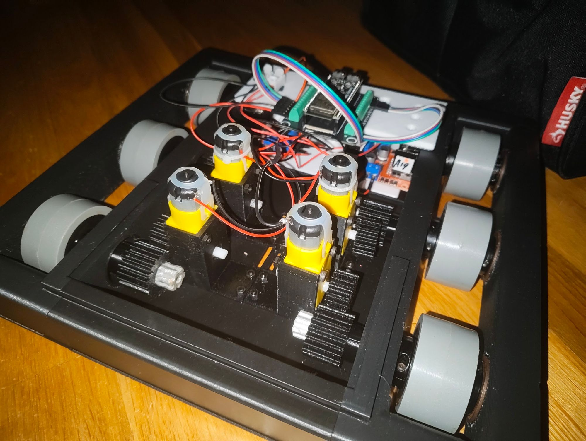

# PushBot

My old high-school robot, back off the floor.

I built PushBot around my freshman or sophomore year of high school. It broke,
ended up on my floor, and stayed there for a while. This repo is the revival:
new electronics and firmware so it can be driven from a phone again.

## What PushBot is

PushBot is a small **tank-drive robot**. A 3D-printed black chassis carries six
grey wheels, three per side. Four yellow 5 V TT gear motors turn them through
printed spur gears, two motors per side. Both wheels on a side always turn
together, so it steers like a tank: both sides forward drives straight, and
opposite directions spin it in place.

The brain is a **Lonely Binary ESP32-S3 N16R8** (16 MB flash, 8 MB PSRAM) on
Lonely Binary's **screw-terminal base**. Two red **L298N** dual H-bridge boards
drive the motors, one for the left pair and one for the right pair. A 7 V
battery powers the motors.

## The goal

Drive the robot from a phone browser with **nothing else**: no app, no
computer, no internet, no cloud service. The ESP32 runs the robot and also
serves the driver station web page itself. Open a web address and drive.

It should also be **safe to hand to someone**. Driving needs a deliberate
Enable, and any lost connection, lost focus, or missed command stops the
motors.

## What it does

- **Phone driver station** built into the firmware, with two on-screen thumb
  sticks. The left stick drives forward and back, and the right stick turns.
  Use both for curves, or turn alone to spin in place. The thumb-stick code is
  adapted from my [MotionModule](https://github.com/AloeVeraZ/MotionModule)
  project.
- **Also drivable** with a keyboard (WASD, Space to stop) or a game controller
  on a laptop.
- **Works on your home Wi-Fi or on its own.** Save a home network in the Wi-Fi
  tab and PushBot joins it whenever it's in range, at http://pushbot.local/.
  Away from home it makes its own **Pushbot** Wi-Fi network instead.
- **Safety first:**
  - Enable is deliberate, and only one driver can hold control.
  - The robot starts at a 40% speed limit.
  - A 500 ms watchdog in the firmware stops the motors if commands stop
    arriving.
  - Leaving the page, losing Wi-Fi, a cancelled touch, or rotating the phone
    disables the robot.
  - The motors ramp up smoothly instead of jerking.
- **Status light:** the board's RGB LED shows what the robot is doing: blue or
  green while waiting, colours for each drive direction, and red for faults.

## Driving it

1. Lift the wheels for the first test, then power on PushBot.
2. Connect a phone:
   - **At home** (after saving your network once): stay on your home Wi-Fi and
     open **http://pushbot.local/**, or the address shown in the Wi-Fi tab.
   - **Anywhere else:** join the **Pushbot** Wi-Fi (password `pushbot-drive`),
     tell the phone to stay connected without internet, and open
     **http://192.168.4.1/**.
3. Tick the safety box and press **Enable**.
4. Drive with the two sticks. **Stop all outputs** stops everything
   immediately.

To save a home network: open the **Wi-Fi** tab, tap **Scan for networks**, pick
your network (2.4 GHz only), enter its password, and tap **Save & connect**.

## Hardware

| Part | Notes |
|---|---|
| Lonely Binary ESP32-S3 N16R8 + screw-terminal base | The controller and web server |
| 2 × red L298N motor drivers | One per side; ENA/ENB jumpers stay **on** |
| 4 × 5 V TT gear motors | Two per side, through printed gears to six wheels |
| 7 V battery | Into each L298N's **12V** terminal; all grounds joined |

Motor wiring (ESP32 screw terminal → L298N input):

| Motor | IN1 | IN2 | ESP32 terminal block |
|---|---:|---:|---|
| Front left | GPIO 13 | GPIO 14 | Left |
| Rear left | GPIO 11 | GPIO 12 | Left |
| Front right | GPIO 1 | GPIO 2 | Right |
| Rear right | GPIO 42 | GPIO 41 | Right |

The right motors are inverted in software because they're mounted as a mirror
image of the left ones. If a wheel spins the wrong way, flip its `INVERT_*`
constant in the sketch. Don't swap wires.

## Flashing

The final firmware is [firmware/Pushbot](firmware/Pushbot). Open
`Pushbot.ino` in Arduino IDE with the Espressif **esp32** board package
(tested with 3.3.11). No extra libraries are needed. Use these **Tools**
settings:

| Setting | Value |
|---|---|
| Board | ESP32S3 Dev Module |
| USB CDC On Boot | Enabled |
| USB Mode | Hardware CDC and JTAG |
| Flash Size | 16MB (128Mb) |
| Partition Scheme | 16M Flash (3MB APP/9.9MB FATFS) |
| PSRAM | OPI PSRAM |

Then select the board's USB port and **Upload**. With the USB cable plugged in,
a serial monitor at 115200 baud answers two read-only commands:
- `?` prints the network, address and drive state.
- `p` reads the actual level on all eight motor pins.

## Known issues

- **Battery-only power:** with USB unplugged, the board restarts when Wi-Fi
  starts (magenta light). The 5 V that the L298N makes from a 7 V battery sags
  under the Wi-Fi current. The firmware already uses low Wi-Fi power and a
  slower CPU. The real fix is a **5 V buck converter** (2 A or more) from the
  battery to the base's 5V/GND terminals, or a USB power bank in the board's
  USB-C port.
- **Motors not turning yet:** in the last test the motors didn't turn. The
  `p` self-test showed every ESP32 motor pin switching correctly for forward
  and reverse, so the code side works. What's left is the driver power
  wiring:
  - The battery + must go to each L298N's **12V** screw.
  - Use real wire clamped under the screws, not jumper-wire pins.
  - Check that the driver LEDs stay lit with USB unplugged.
- An L298N loses about 2 V, so from 7 V the motors see roughly 5 V at full
  output. The 40% starting speed limit may be too low to start them; raise
  the slider.

## What's in this repo

| Folder | What it is |
|---|---|
| [firmware/Pushbot](firmware/Pushbot) | **Final firmware** (Arduino IDE): robot control, driver station, Wi-Fi |
| [testing](testing) | Development copy of the same firmware, its browser tests (`node testing/driver_station.test.cjs`), and a [detailed README](testing/README.md) covering wiring, power limits and the LED legend |
| Repo root (`main.cpp`, `index.html`, `platformio.ini`, …) | My first revival attempt (PlatformIO, older pin map and power plan). Kept for reference; superseded by `firmware/Pushbot` |

GitHub Actions still checks the original PlatformIO version, and also runs the
final firmware's browser tests.

Hardware references: [Lonely Binary ESP32-S3 power](https://learn.lonelybinary.com/boards/esp32-s3/powering-the-board),
[screw-terminal base pinout](https://learn.lonelybinary.com/pinouts/s3screw),
[ST L298 datasheet](https://www.st.com/resource/en/datasheet/cd00000240.pdf).
